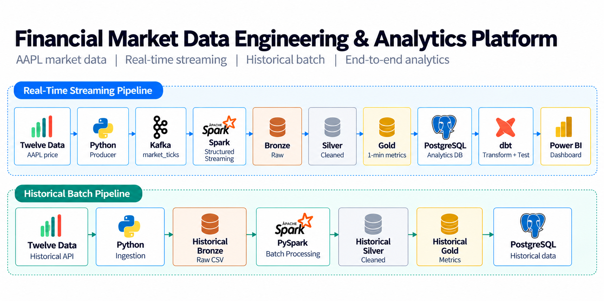
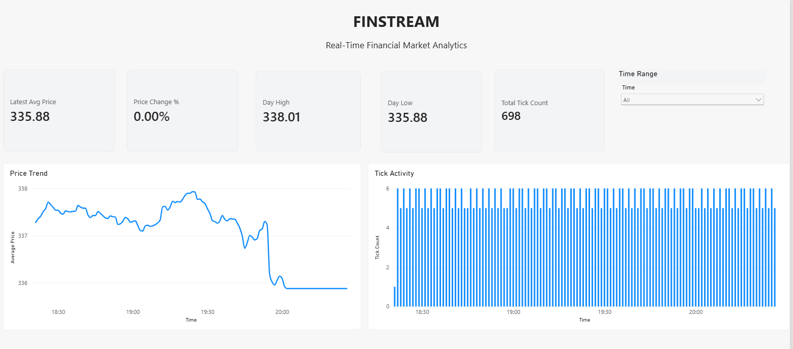
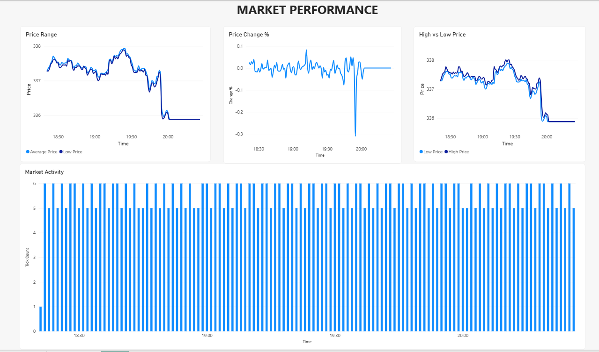

# FinStream — Real-Time Financial Market Data Engineering & Analytics Platform

FinStream is an end-to-end Data Engineering project that ingests real financial market data from the Twelve Data API and processes it through both real-time streaming and historical batch pipelines.

The platform uses Apache Kafka for event streaming, Apache Spark Structured Streaming and PySpark for processing, Parquet for data storage, PostgreSQL as the analytical serving layer, dbt for analytical transformation and data quality testing, and Power BI for visualization.

The project follows a **Bronze → Silver → Gold Medallion Architecture** and demonstrates practical Data Engineering concepts from data ingestion to analytics.

---

## Architecture




### High-Level Architecture

```text
                         Twelve Data API
                               |
                +--------------+--------------+
                |                             |
                v                             v
       REAL-TIME STREAMING             HISTORICAL BATCH
                |                             |
       Python Market Producer       Python Historical Ingestion
                |                             |
                v                             v
            Apache Kafka             Historical Bronze
                |                             |
                v                             v
     Spark Structured Streaming          PySpark
                |                             |
                v                             v
             Bronze                       Silver
                |                             |
                v                             v
             Silver                        Gold
                |                             |
                v                             v
              Gold                    PostgreSQL
                |
                v
           PostgreSQL
                |
                v
               dbt
                |
                v
            Power BI

```

### 1. Project Overview

FinStream is designed to demonstrate an end-to-end financial market data engineering workflow using real external market data.

The project contains two independent processing pipelines.

### Real-Time Streaming Pipeline

```text
Twelve Data API
      ↓
Python Market Producer
      ↓
Apache Kafka
      ↓
Spark Structured Streaming
      ↓
Bronze
      ↓
Silver
      ↓
Gold
      ↓
PostgreSQL
      ↓
dbt
      ↓
Power BI
```

### Historical Batch Pipeline

```text
Twelve Data Historical API
      ↓
Python Historical Ingestion
      ↓
Historical Bronze
      ↓
PySpark
      ↓
Historical Silver
      ↓
Historical Gold
      ↓
PostgreSQL

```

The primary focus of the project is Data Engineering rather than financial prediction or machine learning.

### 2. Project Objectives

The main objectives of FinStream are:

Ingest real financial market data from an external API.
Build a continuous market-data ingestion pipeline.
Use Apache Kafka as a streaming message broker.
Process streaming data using Spark Structured Streaming.

Implement

```text
Bronze → Silver → Gold data layers.
```

Store processed data using Parquet.
Build a separate historical batch-processing pipeline using PySpark.
Implement data-quality validation.
Store analytical data in PostgreSQL.
Implement incremental analytical transformations using dbt.
Apply dbt data-quality tests.
Build Power BI dashboards for market analytics.
Maintain project configuration and dependencies through Git/GitHub.

### 3. Real-Time Streaming Pipeline

The real-time pipeline continuously retrieves the current AAPL market price from the Twelve Data API and processes the resulting events through Kafka and Spark Structured Streaming.

```text
Twelve Data API
       ↓
Python Market Producer
       ↓
Apache Kafka
       ↓
Spark Structured Streaming
       ↓
Bronze → Silver → Gold
       ↓
PostgreSQL
       ↓
dbt
       ↓
Power BI
```

### 3.1 Twelve Data API

Twelve Data provides the external financial market data used by the project.

The current implementation retrieves the current price of:

```text

AAPL
```

The project uses real external market data rather than generated or synthetic market events.

### 4. Python Market Producer

The Python producer is responsible for retrieving market data and publishing market events to Kafka.

### Responsibilities

- Call the Twelve Data API
- Retrieve the current AAPL price
- Create a market event
- Add an event timestamp
- Publish the event to Kafka
- Use AAPL as the Kafka message key
- Handle API request failures
- Retry failed API requests

Example event:

```text
{
  "symbol": "AAPL",
  "price": 341.040009,
  "event_time": "2026-09-27T19:50:42.025114+00:00"
}
```

### Kafka Configuration

Topic: market_ticks
Key: AAPL

Using the market symbol as the Kafka key allows events for the same symbol to be routed consistently to a Kafka partition.

### 5. Apache Kafka

Apache Kafka acts as the message broker between the Python producer and Spark Structured Streaming.

```text

Python Market Producer
          |
          v
      Apache Kafka
          |
    market_ticks
          |
          v
Spark Structured Streaming
```

Kafka provides the streaming layer that decouples data ingestion from downstream stream processing.

### Kafka Topic

```text
market_ticks
```

### Kafka Message

```text
Key:
AAPL

Value:
{
    symbol,
    price,
    event_time
}
```

### 6. Spark Structured Streaming

Spark Structured Streaming consumes events from the Kafka topic.

The streaming application:

- Reads the market_ticks Kafka topic.
- Converts Kafka values into strings.
- Parses JSON events.
- Applies a defined schema.
- Converts the event timestamp.
- Processes incoming events continuously.
- Writes the processed data into the Bronze layer.

Spark then processes the data through the downstream

```text
 Bronze → Silver → Gold architecture.
```

### 7. Medallion Architecture

FinStream follows a three-layer Medallion Architecture:

```text

BRONZE
Raw / minimally processed data
        ↓
SILVER
Cleaned / validated data
        ↓
GOLD
Business-ready analytical metrics
```

The same conceptual architecture is applied to both the real-time streaming and historical batch pipelines.

### 8. Streaming Bronze Layer

The Bronze layer stores raw streaming events received from Kafka.

### Technology

```text

Parquet
```

### Path

```text
data/bronze/market_ticks
```

### Purpose

The Bronze layer provides the raw/minimally processed representation of the incoming streaming events before downstream validation and transformation.

### 9. Streaming Silver Layer

The Silver layer cleans and validates the streaming Bronze data.

### Data Quality Rules

```text
symbol IS NOT NULL
price IS NOT NULL
price > 0
event_time IS NOT NULL
```

The Silver layer ensures that invalid market events are removed before analytical processing.

### Technology

```text
Parquet
```

### Path

```text
data/silver/market_ticks
```

### 10. Streaming Gold Layer

The Gold layer generates analytical market metrics using event-time processing.

### Streaming Configuration

```text
Window: 1 minute
Watermark: 30 seconds
```

### Metrics

The Gold layer generates:

- Average price
- Minimum price
- Maximum price
- Tick count

### Gold Schema

```text
symbol
window_start
window_end
avg_price
min_price
max_price
tick_count
```

### Technology

```text
Parquet
```

### Path

```text
data/gold/market_metrics_v2
```

The Gold layer provides business-ready metrics for downstream analytical processing.

### 11. Historical Batch Pipeline

FinStream also contains a separate historical batch-processing pipeline.

This pipeline processes historical AAPL 1-minute OHLCV market data.

```text

Twelve Data Historical API
          ↓
Python Historical Ingestion
          ↓
Historical Bronze
          ↓
PySpark
          ↓
Historical Silver
          ↓
Historical Gold
          ↓
PostgreSQL
```

The historical pipeline is intentionally separate from the continuous streaming pipeline.

### 12. Historical Data Ingestion

The Python historical ingestion process retrieves historical market data from Twelve Data.

The historical dataset contains:

```text

symbol
datetime
open
high
low
close
volume
```

The raw data is written to CSV.

During project validation, 500 historical records were retrieved.

### 13. Historical Bronze Layer

The historical Bronze layer contains the raw historical market data.

### Format

```text
CSV
```

### Path

```text
data/batch_bronze/market_history
```

The Bronze layer preserves the raw historical records before PySpark transformations.

### 14. Historical Silver Layer

PySpark processes the historical Bronze data and performs data cleaning and validation.

### Transformations

- Convert datetime to timestamp.
- Convert OHLC fields to numeric types.
- Convert volume to numeric type.
- Validate required fields.
- Validate close price.
- Validate volume.

### Data Quality Rules

```text
symbol IS NOT NULL
datetime IS NOT NULL
close IS NOT NULL
close > 0
volume IS NOT NULL
volume >= 0
```

### Output

```text
Parquet
```

### Path

```text
data/batch_silver/market_history
```

### 15. Historical Gold Layer

The historical Silver data is transformed into analytical market metrics.

### Metrics

- Average close price
- Minimum price
- Maximum price
- Total volume
- Tick count

### Schema

symbol
window_start
window_end
avg_close_price
min_price
max_price
total_volume
tick_count

### Output

```text
Parquet
```

### Path

```text
data/batch_gold/market_metrics
```

During validation:

```text
Historical records processed: 500
Historical Gold windows: 500
```

### 16. PostgreSQL Analytical Layer

PostgreSQL acts as the analytical serving database for the processed Gold data.

### Streaming Tables

```text
market_metrics
market_metrics_staging
market_metrics_analytics
```

### Historical Table

```text
historical_market_metrics
```

The streaming Gold data is first loaded into a staging table and then merged into the main analytical table.

A unique constraint is applied to:

```text
symbol
window_start
window_end
```

This helps prevent duplicate analytical windows and supports idempotent loading.

### 17. PostgreSQL Analytics View

The streaming analytical view derives additional price-change metrics using SQL window functions.

The analytical layer calculates:

```text
previous_avg_price
price_change
price_change_pct
```

Conceptually:

```text
price_change =
current average price - previous average price
```

And:

```text
price_change_pct =
((current average price - previous average price)
 / previous average price) × 100
```

This creates analytical fields that are consumed by downstream reporting.

### 18. dbt Analytics Layer

dbt is used for downstream analytical transformation and data-quality testing.

### dbt Model

```text
finstream_dbt/models/analytics/market_metrics.sql
```

The model is configured as an incremental model.

### dbt Responsibilities

- Read analytical data from PostgreSQL.
- Perform incremental transformations.
- Calculate previous average price.
- Calculate price change.
- Calculate price change percentage.
- Run data-quality tests.

### 19. dbt Data Quality Tests

The project contains not_null tests for:

```text
symbol
window_start
window_end
avg_price
tick_count
```

The dbt build was validated successfully.

Validation result:

```text
PASS = 6
WARN = 0
ERROR = 0
SKIP = 0
```

### 20. Power BI Analytics

Power BI is used as the final visualization and analytics layer.

Power BI connects to PostgreSQL analytical data.


### Market Overview

The first dashboard page contains:

- Latest Average Price
- Price Change %
- Day High
- Day Low
- Total Tick Count
- Price Trend
- Tick Activity
- Time Range filter




### Market Performance

The second dashboard page contains:

- Price Range
- Price Change %
- High vs Low Price
- Market Activity




The dashboard allows users to analyze market-price behavior and activity over time.

### 21. Data Quality

Data quality is implemented across the streaming and batch pipelines.

### Streaming Validation

```text
symbol IS NOT NULL
price IS NOT NULL
price > 0
event_time IS NOT NULL
```

### Historical Validation

```text
symbol IS NOT NULL
datetime IS NOT NULL
close IS NOT NULL
close > 0
volume IS NOT NULL
volume >= 0
```

### Gold-Level Validation

Additional validation was performed on Gold data to verify:

- Valid minimum/maximum price relationships.
- Valid average-price ranges.
- Positive tick counts.
- Non-negative historical volume.
- Valid analytical windows.

During validation, the streaming and historical Gold datasets returned zero invalid records for the implemented quality checks.

### 22. Project Structure

```text
FinStream/
│
├── ingestion/
│   ├── market_producer.py
│   └── test_market_api.py
│
├── streaming/
│   ├── kafka_to_spark.py
│   ├── bronze_to_silver.py
│   └── silver_to_gold.py
│
├── batch/
│   ├── historical_ingestion.py
│   ├── historical_bronze_to_silver.py
│   ├── historical_silver_to_gold.py
│   ├── historical_gold_to_postgres.py
│   ├── load_gold_to_postgres.py
│   └── export_gold_to_csv.py
│
├── finstream_dbt/
│   ├── dbt_project.yml
│   ├── README.md
│   └── models/
│       ├── analytics/
│       │   └── market_metrics.sql
│       ├── schema.yml
│       └── sources.yml
│
├── docs/
│   ├── architecture.png
│   ├── dashboard1.png
│   └── dashboard2.png
│
├── requirements.txt
├── .env.example
├── .gitignore
└── README.md
```

### 23. Technology Stack

```text
| Layer                    | Technology                 |
| ------------------------ | -------------------------- |
| Market Data              | Twelve Data API            |
| Programming              | Python                     |
| Streaming                | Apache Kafka               |
| Stream Processing        | Spark Structured Streaming |
| Batch Processing         | PySpark                    |
| Storage                  | Parquet                    |
| Analytical Database      | PostgreSQL                 |
| Analytics Transformation | dbt                        |
| Visualization            | Power BI                   |
| Version Control          | Git / GitHub               |
```

### 24. Environment Configuration

Create a local .env file using .env.example.

Required variables:

```text
TWELVE_DATA_API_KEY=your_twelve_data_api_key
POSTGRES_PASSWORD=your_postgres_password
```

The actual .env file is excluded from Git.

Secrets should never be committed to the repository.

### 25. Installation

Create and activate a Python virtual environment:

```text
python3 -m venv .venv
source .venv/bin/activate
```

Install Python dependencies:

```text
pip install -r requirements.txt
```

The project dependencies include:

```text
requests
python-dotenv
kafka-python
pyspark
dbt-core
dbt-postgres
```

### 26. Running the Streaming Pipeline

### Step 1 — Start Kafka

Start the local Kafka broker.

### Step 2 — Start the Market Producer

```text
python ingestion/market_producer.py
```

The producer publishes events to:

```text
market_ticks
```

### Step 3 — Start Kafka to Bronze

```text
spark-submit \
  --packages org.apache.spark:spark-sql-kafka-0-10_2.13:4.2.0 \
  streaming/kafka_to_spark.py
```

### Step 4 — Start Bronze to Silver

```text
spark-submit streaming/bronze_to_silver.py
```

### Step 5 — Start Silver to Gold

```text
spark-submit streaming/silver_to_gold.py
```

The streaming pipeline then produces:

```text
Kafka
 ↓
Bronze
 ↓
Silver
 ↓
Gold
```

### 27. Running the Historical Pipeline

Run historical ingestion:

```text
python batch/historical_ingestion.py
```

Then run the PySpark transformations:

```text
Historical Bronze
        ↓
Historical Silver
        ↓
Historical Gold
        ↓
PostgreSQL
```

The historical pipeline processes real historical AAPL OHLCV data retrieved from Twelve Data.

### 28. Running dbt

Move into the dbt project:

```text
cd finstream_dbt
```

Check the dbt connection:

```text
dbt debug
```

Run the model and data-quality tests:

```text
dbt build
```

### 29. Validation Results

### Real-Time Streaming

The streaming pipeline was validated by:

- Successfully connecting to the Twelve Data API.
- Successfully retrieving AAPL market prices.
- Successfully publishing events to Kafka.
- Successfully consuming Kafka events.
- Verifying AAPL as the Kafka message key.
- Processing events through Bronze → Silver → Gold.
- Loading Gold data into PostgreSQL.
- Validating Gold analytical records.
- Running dbt transformations and tests successfully.

### Historical Batch

The historical pipeline was validated with:

```text
500 historical records retrieved
500 records processed through Silver
500 Gold analytical windows generated
500 records loaded into PostgreSQL
```

Historical Gold validation returned zero invalid records for the implemented quality checks.

### 30. Key Data Engineering Concepts Demonstrated

This project demonstrates practical experience with:

- REST API ingestion
- Real external financial data ingestion
- Kafka producers
- Kafka topics
- Kafka message keys
- Kafka partitioning
- Spark Structured Streaming
- PySpark
- JSON parsing
- Event-time processing
- Windowed aggregations
- Watermarks
- Bronze → Silver → Gold architecture
- Parquet storage
- Data-quality validation
- PostgreSQL
- Staging tables
- Merge-based loading
- Idempotent loading
- SQL window functions
- dbt incremental models
- dbt data-quality tests
- Power BI
- Environment-based secret management
- Git/GitHub

### 31. Project Highlights

### Real Financial Data

The project uses real financial market data from Twelve Data rather than synthetic datasets.

### Streaming Architecture

Kafka and Spark Structured Streaming provide a continuous event-processing pipeline.

### Batch Architecture

A separate PySpark pipeline processes historical OHLCV data.

### Medallion Architecture

Both pipelines follow:

```text
Bronze → Silver → Gold
```

### Analytical Serving

PostgreSQL provides a centralized analytical serving layer.

### Analytics Engineering

dbt provides incremental transformations and data-quality testing.

### Business Visualization

Power BI provides market analytics and visualization.

### 32. Future Improvements

Potential future improvements include:

- Support for multiple financial instruments.
- Advanced streaming monitoring.
- Invalid-event quarantine handling.
- Additional data-quality rules.
- Workflow orchestration.
- Containerized deployment.
- Cloud deployment.
- Advanced analytical data modeling.
- Production-grade observability.

These are future improvements and are not part of the current implementation.

### 33. End-to-End Data Flow

The complete project can be summarized as:

```text


                    REAL FINANCIAL MARKET DATA
                              |
                +-------------+-------------+
                |                           |
                v                           v
       REAL-TIME STREAMING           HISTORICAL BATCH
                |                           |
         Python Producer             Python Ingestion
                |                           |
                v                           v
             Kafka                    Historical Bronze
                |                           |
                v                           v
      Spark Structured Streaming          PySpark
                |                           |
                v                           v
             Bronze                     Silver
                |                           |
                v                           v
             Silver                      Gold
                |                           |
                v                           v
              Gold                    PostgreSQL
                |
                v
           PostgreSQL
                |
                v
               dbt
                |
                v
            Power BI
```

### 34. Conclusion

FinStream demonstrates an end-to-end Data Engineering workflow starting with real financial market data and progressing through:

```text
Data Ingestion
      ↓
Streaming / Batch Processing
      ↓
Bronze
      ↓
Silver
      ↓
Gold
      ↓
PostgreSQL
      ↓
dbt
      ↓
Power BI
```

The project combines real-time streaming, historical batch processing, data quality, analytical storage, transformation, and business visualization into a single Data Engineering platform.

### FinStream

### Real-Time Financial Market Data Engineering & Analytics Platform

Built with:

### Python · Apache Kafka · Spark · PySpark · Parquet · PostgreSQL · dbt · Power BI · Twelve Data
